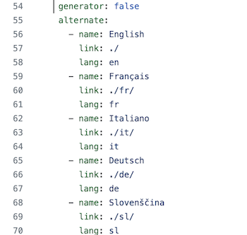
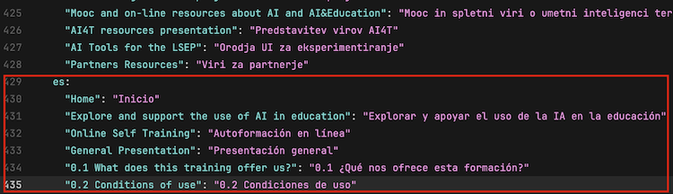
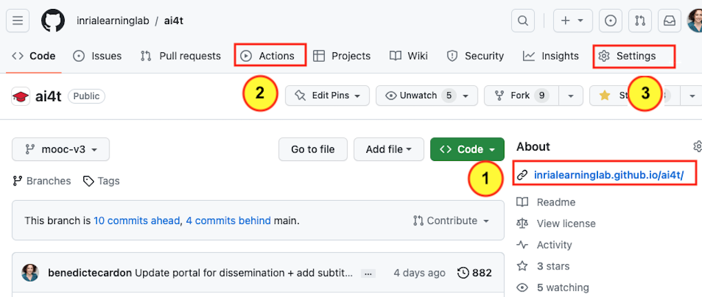
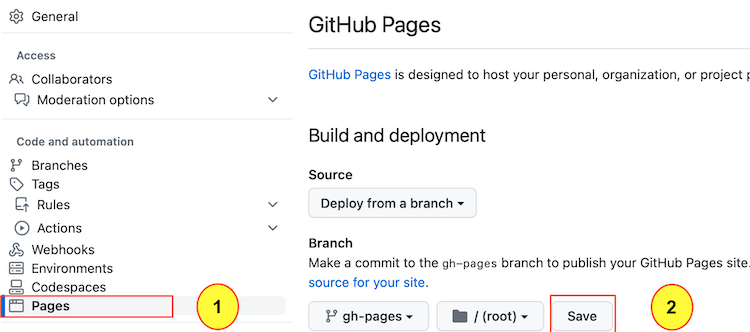
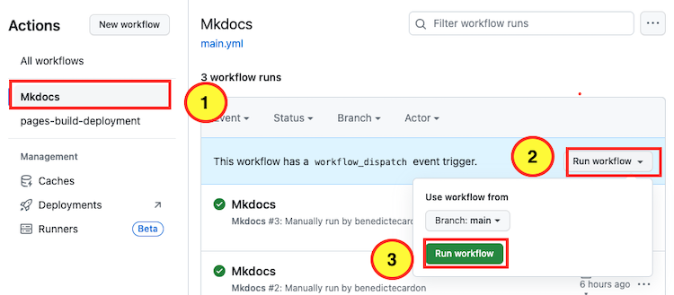

## Aktualizácia viacjazyčnej navigácie

Prvým krokom je aktualizácia súboru **mkdocs.yml**.

*1 - Vytvorte nový jazyk pre navigačnú kartu*.

Nový jazyk pridajte k existujúcim jazykom pomocou rovnakého skriptu.

<figure class="image-frame">
    
</figure>
<figcaption>Skript na nastavenie parametrov jazyka v dokumente .yml.</figcaption>

- name**: názov jazyka, ako sa bude zobrazovať na navigačnej karte

- link**: rozšírenie všetkých statických webových stránok v novom jazyku

- lang**: ID použité na konci každého súboru markdown pre jeden jazyk

🏗️ Pridanie španielčiny na navigačnú kartu

- name**: Español

- odkaz** : . /es/

- jazyk** : es

*2 - Preklad názvov a obsahu

⌨️ Pridajte nové položky s identifikátorom nového jazyka: tu **es** pre **španielčinu**. **Všetky existujúce navigácie musia byť uvedené v novom cieľovom jazyku.

🏗️ Použite **es** pre **španielčinu**.

<figure class="image-frame">
    
</figure>
<figcaption>Príklad úpravy skriptu na umožnenie navigácie v španielčine.</figcaption>

## Ako generovať statické webové stránky

Pomocou stránok GitHub môžete generovať statické webové stránky a prezerať všetky zdroje Mooc pomocou webového prehliadača.
Na stránke projektu GitHub môžete zobraziť preddefinovanú adresu statických webových stránok ako [YOURNAME[.GitHub.io/ai4t/].

<figure class="image-frame" >
      tab."&gt;
</figure>
<figcaption>Prístup k preddefinovanej adrese statických webových stránok a umiestnenie karty akcie.</figcaption>

<figure class="inline-image">
    
    
Prístup k zobrazeniu stránok GitHub.

</figure>

<figure class="inline-image">
    
    
Karta Action (Akcia): miesto, kam môžete prejsť na generovanie statických webových stránok.

</figure>

<figure class="inline-image">
    
    
Karta Nastavenie: aktualizujte pred prechodom na kartu Akcia.

</figure>

<figure class="image-frame" >
    
</figure>
<figcaption>Prístup k nastaveniam odovzdania stránky github.</figcaption>

<figure class="inline-image">
    
    
Po vstupe do konfigurácie vyberte kartu Stránky.

</figure>

<figure class="inline-image">
    
    
Kliknutím na tlačidlo overte zmeny na stránkach github.

</figure>

<figure class="image-frame" >
    
</figure>
<figcaption>Ako vygenerovať nový pracovný postup na karte akcie.</figcaption>

Ak chcete vygenerovať pracovný postup, vyberte 3 prvky vo vyššie uvedenom poradí.

Vykonanie úlohy bude trvať určitý čas (niekoľko minút). Potom dôjde k oneskoreniu pri generovaní statických webových stránok, takže musíte chvíľu počkať, kým si ich budete môcť pozrieť na stránke **YOURNAME.GitHub.io/ai4t/**.

Tieto pokyny sú veľmi zjednodušenou prezentáciou toho, ako zobraziť stránky Gitbub. Podrobnejšie informácie nájdete v oficiálnej dokumentácii systému Git: [https://pages.GitHub.com/](https://pages.GitHub.com/)
